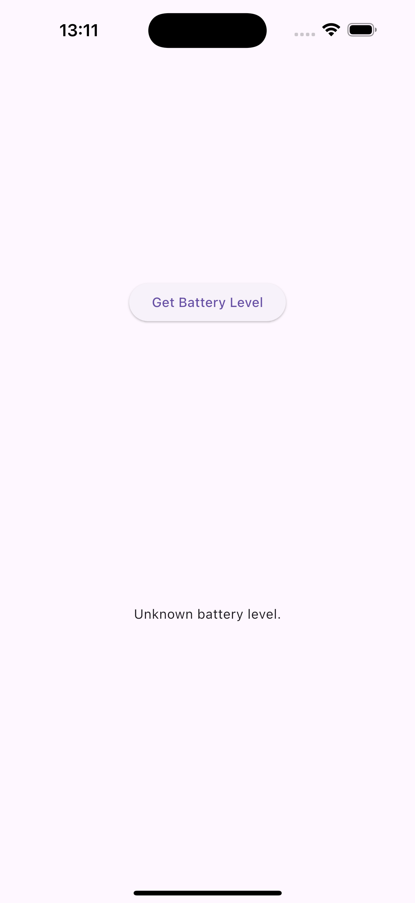
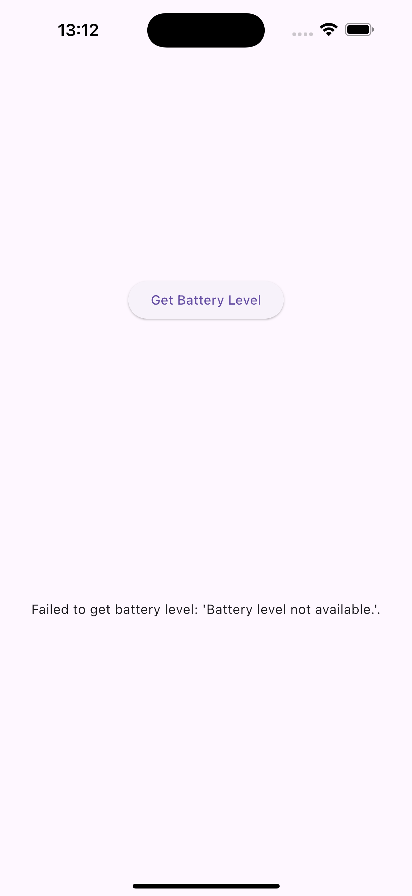
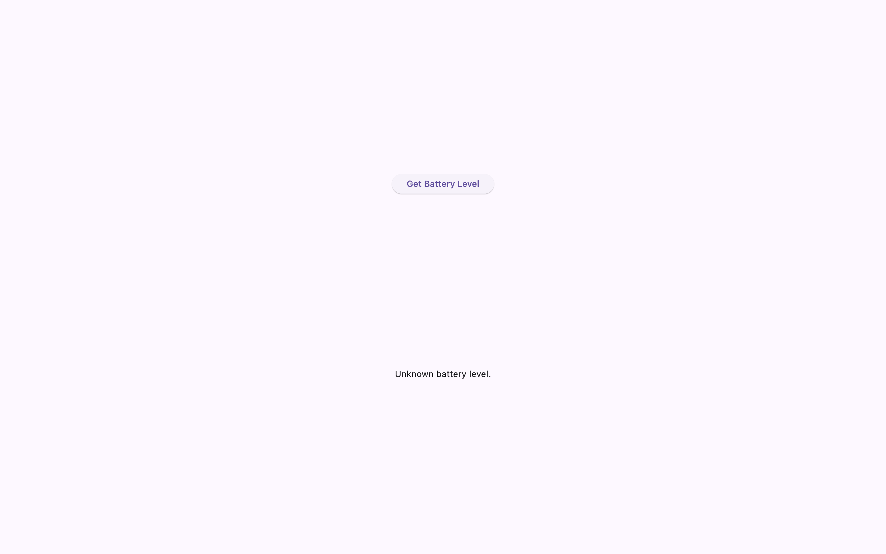
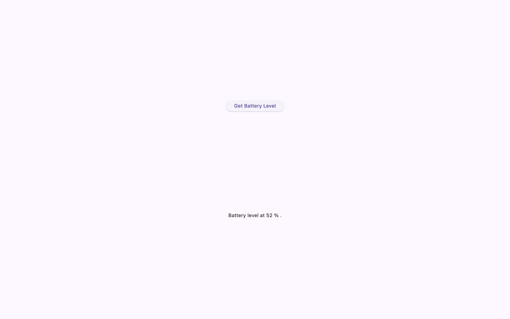
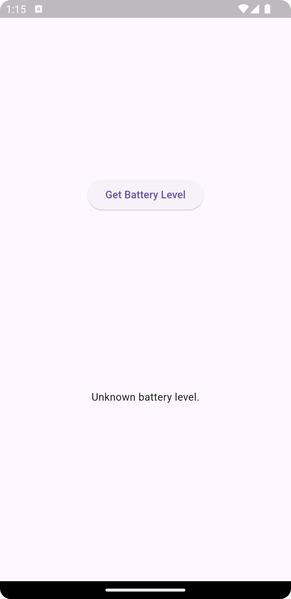
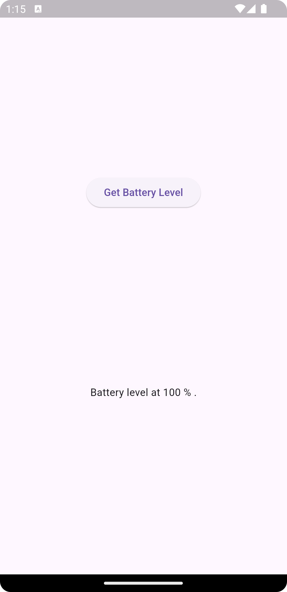

# Flutter Platform Channel Example

This app gets the information about battery via method channel.

## Table of Contents

- [Features](#features)
- [Screenshots](#screenshots)

## Features

- Get battery level

## Screenshots

  
  
  

  
  
  

